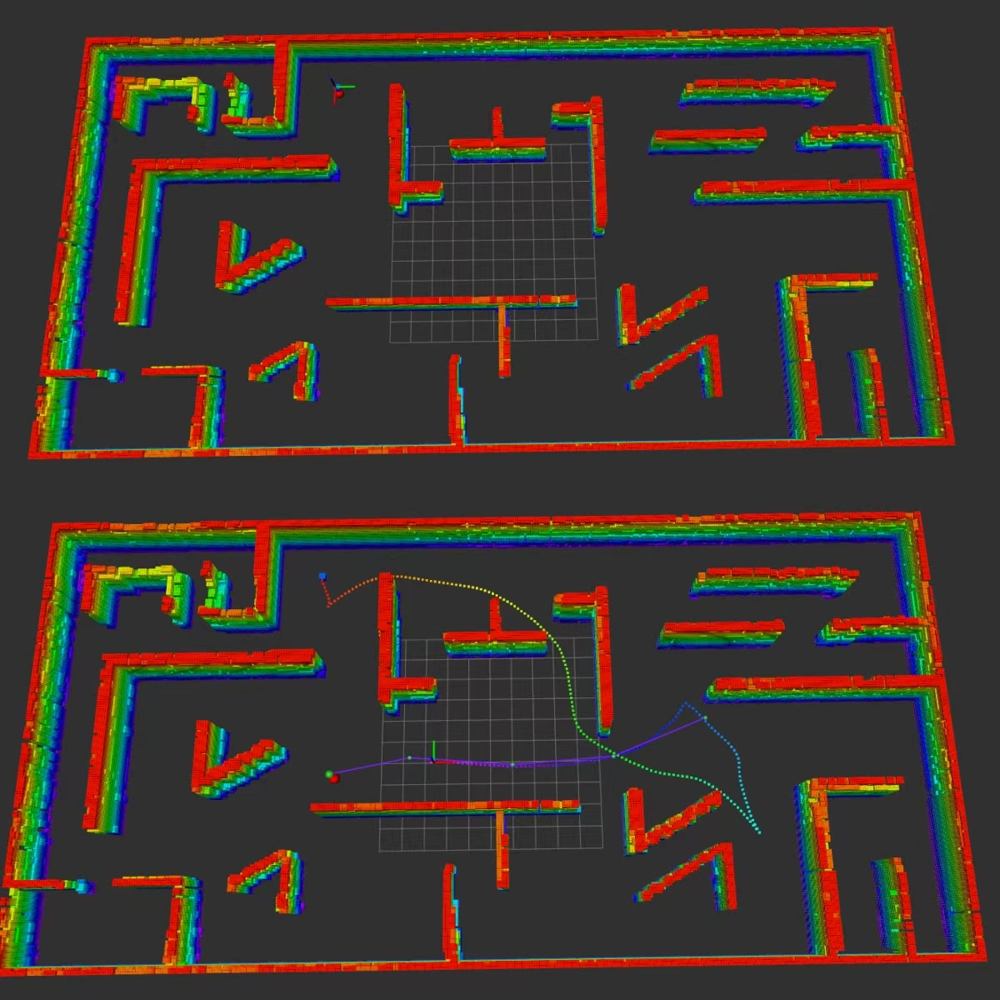

# autonomous_navigation
A navigation algorithm based on CMU team's open-source local planner


This repository is developed based on the autonomius_deploration_development_denvironment repository, using a constructed octree map and RRT * algorithm to add global guidance to the local path planner for ground autonomous navigation and exploration. It has achieved good results in simulated maze, corridor, and cylindrical obstacle environments.

Video Tutorial:  [BiliBili](https://www.bilibili.com/video/BV1rexCzuECi?t=1.2) (for China mainland)
## Usage

The repository has been tested in Ubuntu 20.04 with ROS Noetic. Follow instructions in [Autonomous Exploration Development Environment](http://cmu-exploration.com) to setup the development environment. 

Install dependencies with command lines below.
```
sudo apt update
sudo apt install libusb-dev
sudo apt install ros-noetic-octomap*
```

Clone the repository.
```
cd your_ws/src
git clone https://github.com/jiale67/autonomous_navigation
catkin_make
```
To run the code, source the ROS workspace, and launch.
```
source ./devel/setup.bash 
roslaunch vehicle_simulator global_navigation.launch 
```
Or only initiate local planning
```
source ./devel/setup.bash 
roslaunch vehicle_simulator local_navigation.launch 
```
Now you can use 2D Nav Goal to send waypoint driven robots in rviz

通过dockerfile构建一个叫做ros_noetic_automous的镜像
sudo docker build -t ros_noetic_automous:latest .

将工作空间挂载到编译的镜像下面 将automous_navigation换成自己的工作空间的名字
sudo docker run --rm -it \
  --name ros_noetic_dev \
  --env="DISPLAY" \
  --env="QT_X11_NO_MITSHM=1" \
  --volume="/tmp/.X11-unix:/tmp/.X11-unix:rw" \
  --volume="$HOME/automous_navigation:/catkin_ws" \
  --network host \
  --privileged \
  ros_noetic_automous:latest \
  /bin/bash

在容器内编译
cd /catkin_ws
catkin config --init
catkin build


运行前
xhost +local:
允许docker访问宿主机的X11图形显示